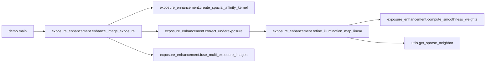
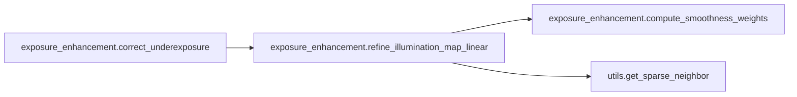
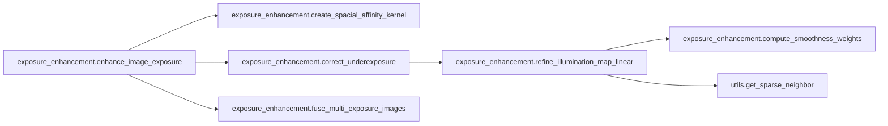
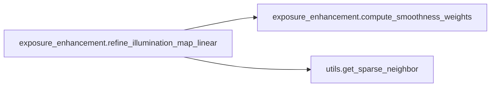

# Key Objects

[_Documentation generated by Documatic_](https://www.documatic.com)

<!---Documatic-section-exposure_enhancement.fuse_multi_exposure_images-start--->
## exposure_enhancement.fuse_multi_exposure_images

<!---Documatic-section-fuse_multi_exposure_images-start--->
<!---Documatic-block-exposure_enhancement.fuse_multi_exposure_images-start--->
<details>
	<summary><code>exposure_enhancement.fuse_multi_exposure_images</code> code snippet</summary>

```python
def fuse_multi_exposure_images(im: np.ndarray, under_ex: np.ndarray, over_ex: np.ndarray, bc: float=1, bs: float=1, be: float=1):
    merge_mertens = cv2.createMergeMertens(bc, bs, be)
    images = [np.clip(x * 255, 0, 255).astype('uint8') for x in [im, under_ex, over_ex]]
    fused_images = merge_mertens.process(images)
    return fused_images
```
</details>
<!---Documatic-block-exposure_enhancement.fuse_multi_exposure_images-end--->
<!---Documatic-section-fuse_multi_exposure_images-end--->

# #
<!---Documatic-section-exposure_enhancement.fuse_multi_exposure_images-end--->

<!---Documatic-section-demo.main-start--->
## demo.main

<!---Documatic-section-main-start--->


### Object Calls

* exposure_enhancement.enhance_image_exposure

<!---Documatic-block-demo.main-start--->
<details>
	<summary><code>demo.main</code> code snippet</summary>

```python
def main(args):
    imdir = args.folder
    ext = ['png', 'jpg', 'bmp']
    files = []
    [files.extend(glob.glob(imdir + '*.' + e)) for e in ext]
    images = [cv2.imread(file) for file in files]
    directory = join(imdir, 'enhanced')
    if not exists(directory):
        makedirs(directory)
    for (i, image) in tqdm(enumerate(images), desc='Enhancing images'):
        enhanced_image = enhance_image_exposure(image, args.gamma, args.lambda_, not args.lime, sigma=args.sigma, bc=args.bc, bs=args.bs, be=args.be, eps=args.eps)
        filename = basename(files[i])
        (name, ext) = splitext(filename)
        method = 'LIME' if args.lime else 'DUAL'
        corrected_name = f'{name}_{method}_g{args.gamma}_l{args.lambda_}{ext}'
        cv2.imwrite(join(directory, corrected_name), enhanced_image)
```
</details>
<!---Documatic-block-demo.main-end--->
<!---Documatic-section-main-end--->

# #
<!---Documatic-section-demo.main-end--->

<!---Documatic-section-exposure_enhancement.correct_underexposure-start--->
## exposure_enhancement.correct_underexposure

<!---Documatic-section-correct_underexposure-start--->


### Object Calls

* exposure_enhancement.refine_illumination_map_linear

<!---Documatic-block-exposure_enhancement.correct_underexposure-start--->
<details>
	<summary><code>exposure_enhancement.correct_underexposure</code> code snippet</summary>

```python
def correct_underexposure(im: np.ndarray, gamma: float, lambda_: float, kernel: np.ndarray, eps: float=0.001):
    L = np.max(im, axis=-1)
    L_refined = refine_illumination_map_linear(L, gamma, lambda_, kernel, eps)
    L_refined_3d = np.repeat(L_refined[..., None], 3, axis=-1)
    im_corrected = im / L_refined_3d
    return im_corrected
```
</details>
<!---Documatic-block-exposure_enhancement.correct_underexposure-end--->
<!---Documatic-section-correct_underexposure-end--->

# #
<!---Documatic-section-exposure_enhancement.correct_underexposure-end--->

<!---Documatic-section-exposure_enhancement.enhance_image_exposure-start--->
## exposure_enhancement.enhance_image_exposure

<!---Documatic-section-enhance_image_exposure-start--->


### Object Calls

* exposure_enhancement.create_spacial_affinity_kernel
* exposure_enhancement.correct_underexposure
* exposure_enhancement.fuse_multi_exposure_images

<!---Documatic-block-exposure_enhancement.enhance_image_exposure-start--->
<details>
	<summary><code>exposure_enhancement.enhance_image_exposure</code> code snippet</summary>

```python
def enhance_image_exposure(im: np.ndarray, gamma: float, lambda_: float, dual: bool=True, sigma: int=3, bc: float=1, bs: float=1, be: float=1, eps: float=0.001):
    kernel = create_spacial_affinity_kernel(sigma)
    im_normalized = im.astype(float) / 255.0
    under_corrected = correct_underexposure(im_normalized, gamma, lambda_, kernel, eps)
    if dual:
        inv_im_normalized = 1 - im_normalized
        over_corrected = 1 - correct_underexposure(inv_im_normalized, gamma, lambda_, kernel, eps)
        im_corrected = fuse_multi_exposure_images(im_normalized, under_corrected, over_corrected, bc, bs, be)
    else:
        im_corrected = under_corrected
    return np.clip(im_corrected * 255, 0, 255).astype('uint8')
```
</details>
<!---Documatic-block-exposure_enhancement.enhance_image_exposure-end--->
<!---Documatic-section-enhance_image_exposure-end--->

# #
<!---Documatic-section-exposure_enhancement.enhance_image_exposure-end--->

<!---Documatic-section-exposure_enhancement.create_spacial_affinity_kernel-start--->
## exposure_enhancement.create_spacial_affinity_kernel

<!---Documatic-section-create_spacial_affinity_kernel-start--->
<!---Documatic-block-exposure_enhancement.create_spacial_affinity_kernel-start--->
<details>
	<summary><code>exposure_enhancement.create_spacial_affinity_kernel</code> code snippet</summary>

```python
def create_spacial_affinity_kernel(spatial_sigma: float, size: int=15):
    kernel = np.zeros((size, size))
    for i in range(size):
        for j in range(size):
            kernel[i, j] = np.exp(-0.5 * distance.euclidean((i, j), (size // 2, size // 2)) ** 2 / spatial_sigma ** 2)
    return kernel
```
</details>
<!---Documatic-block-exposure_enhancement.create_spacial_affinity_kernel-end--->
<!---Documatic-section-create_spacial_affinity_kernel-end--->

# #
<!---Documatic-section-exposure_enhancement.create_spacial_affinity_kernel-end--->

<!---Documatic-section-exposure_enhancement.refine_illumination_map_linear-start--->
## exposure_enhancement.refine_illumination_map_linear

<!---Documatic-section-refine_illumination_map_linear-start--->


### Object Calls

* exposure_enhancement.compute_smoothness_weights
* utils.get_sparse_neighbor

<!---Documatic-block-exposure_enhancement.refine_illumination_map_linear-start--->
<details>
	<summary><code>exposure_enhancement.refine_illumination_map_linear</code> code snippet</summary>

```python
def refine_illumination_map_linear(L: np.ndarray, gamma: float, lambda_: float, kernel: np.ndarray, eps: float=0.001):
    wx = compute_smoothness_weights(L, x=1, kernel=kernel, eps=eps)
    wy = compute_smoothness_weights(L, x=0, kernel=kernel, eps=eps)
    (n, m) = L.shape
    L_1d = L.copy().flatten()
    (row, column, data) = ([], [], [])
    for p in range(n * m):
        diag = 0
        for (q, (k, l, x)) in get_sparse_neighbor(p, n, m).items():
            weight = wx[k, l] if x else wy[k, l]
            row.append(p)
            column.append(q)
            data.append(-weight)
            diag += weight
        row.append(p)
        column.append(p)
        data.append(diag)
    F = csr_matrix((data, (row, column)), shape=(n * m, n * m))
    Id = diags([np.ones(n * m)], [0])
    A = Id + lambda_ * F
    L_refined = spsolve(csr_matrix(A), L_1d, permc_spec=None, use_umfpack=True).reshape((n, m))
    L_refined = np.clip(L_refined, eps, 1) ** gamma
    return L_refined
```
</details>
<!---Documatic-block-exposure_enhancement.refine_illumination_map_linear-end--->
<!---Documatic-section-refine_illumination_map_linear-end--->

# #
<!---Documatic-section-exposure_enhancement.refine_illumination_map_linear-end--->

<!---Documatic-section-exposure_enhancement.compute_smoothness_weights-start--->
## exposure_enhancement.compute_smoothness_weights

<!---Documatic-section-compute_smoothness_weights-start--->
<!---Documatic-block-exposure_enhancement.compute_smoothness_weights-start--->
<details>
	<summary><code>exposure_enhancement.compute_smoothness_weights</code> code snippet</summary>

```python
def compute_smoothness_weights(L: np.ndarray, x: int, kernel: np.ndarray, eps: float=0.001):
    Lp = cv2.Sobel(L, cv2.CV_64F, int(x == 1), int(x == 0), ksize=1)
    T = convolve(np.ones_like(L), kernel, mode='constant')
    T = T / (np.abs(convolve(Lp, kernel, mode='constant')) + eps)
    return T / (np.abs(Lp) + eps)
```
</details>
<!---Documatic-block-exposure_enhancement.compute_smoothness_weights-end--->
<!---Documatic-section-compute_smoothness_weights-end--->

# #
<!---Documatic-section-exposure_enhancement.compute_smoothness_weights-end--->

<!---Documatic-section-utils.get_sparse_neighbor-start--->
## utils.get_sparse_neighbor

<!---Documatic-section-get_sparse_neighbor-start--->
<!---Documatic-block-utils.get_sparse_neighbor-start--->
<details>
	<summary><code>utils.get_sparse_neighbor</code> code snippet</summary>

```python
def get_sparse_neighbor(p: int, n: int, m: int):
    (i, j) = (p // m, p % m)
    d = {}
    if i - 1 >= 0:
        d[(i - 1) * m + j] = (i - 1, j, 0)
    if i + 1 < n:
        d[(i + 1) * m + j] = (i + 1, j, 0)
    if j - 1 >= 0:
        d[i * m + j - 1] = (i, j - 1, 1)
    if j + 1 < m:
        d[i * m + j + 1] = (i, j + 1, 1)
    return d
```
</details>
<!---Documatic-block-utils.get_sparse_neighbor-end--->
<!---Documatic-section-get_sparse_neighbor-end--->

# #
<!---Documatic-section-utils.get_sparse_neighbor-end--->

[_Documentation generated by Documatic_](https://www.documatic.com)